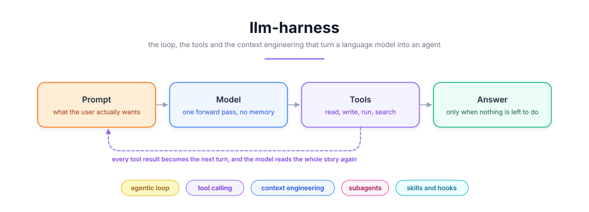
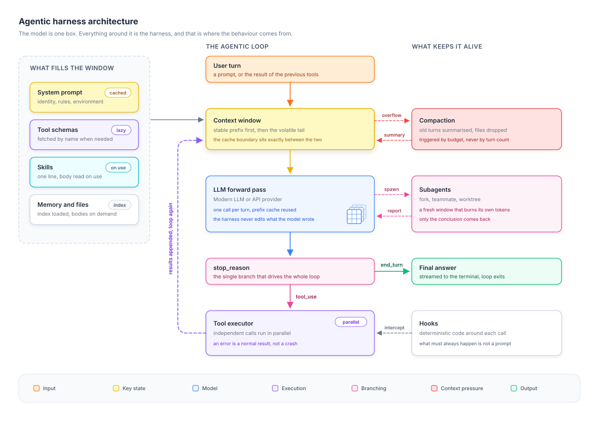

# 🔁 llm-harness


<p align="center">
  
</p>

---

## 📝 Project Description

A language model is **stateless**. It reads tokens, it writes a few more, and it forgets everything. It cannot open a file, run a command, or remember what it did thirty seconds ago. Everything people call "an agent" lives in the program wrapped around that forward pass, and that program is the **harness**.

This repository documents how that harness is built, from the public post-mortems of the **March 2026 Claude Code source leak**, the clean-room rewrites published afterwards, and a direct reading of a running harness from the inside.

The target provider is my own [modern-transformer](https://github.com/Thibault-GAREL/LLMs_modern_from_scratch), so the same loop drives a local model on a 6 GB GPU or a hosted API without changing a line of the loop.

🚨 **The documentation is the deliverable right now.** The Python package in "Repository structure" is the plan, not shipped code.

---

## ⚙️ Features

  🔁 **The loop in fifteen lines**, and why the quality is never in the loop itself

  🧰 **Tool design rules**, few and wide, descriptions written as prompts, errors returned as results

  🧵 **Context engineering**, the cache boundary, the append-only history, and disclosure on demand

  👥 **Delegation**, subagents, skills and hooks, plus when each one is the wrong answer

  ⌨️ **The full command intake**, what the harness answers alone and what actually reaches the model

  🧪 **Provider-agnostic**, the loop never knows if it talks to a local transformer or an API

---

## Example Outputs

One real loop, printed the way a harness log reads. The model never sees the repository, only what the tools bring back.

```
turn 1   user        "why does the training loss explode around step 400"
turn 1   model       stop_reason = tool_use
         harness     ├─ Grep(pattern="warmup", path="src/mt")     ──┐ dispatched
         harness     └─ Read("configs/base.yaml")                 ──┘ in parallel (340 ms)

turn 2   model       stop_reason = tool_use
         harness     └─ Read("src/mt/optim.py", offset=120, limit=60)   (12 ms)

turn 3   model       stop_reason = tool_use
         harness     └─ Read("outputs/logs/base_run-07/run.log", offset=380)
         harness        ERROR: file not found                            (3 ms)

turn 4   model       stop_reason = tool_use
         harness     └─ Glob("outputs/logs/**/run.log")                  (18 ms)

turn 5   model       stop_reason = end_turn
         model       "warmup ends at step 400 and the schedule hands over to
                      a cosine decay that restarts at the peak LR ..."
```

**Turn 3 is the interesting one.** The model guessed a path, it did not exist, and the harness returned the error as a normal result instead of crashing. The model read it, switched to `Glob`, and recovered on its own. Nobody wrote that recovery, it falls out of the loop.

### 📝 Notes & Observations

  🐢 **Latency comes from the model, not the tools.** Four tool calls cost 373 ms together. Five forward passes cost several seconds. That is why independent calls are dispatched at once.

  🧊 **What the cache actually holds.** Not the text, the attention state: every token's key and value vectors, computed once and kept in the provider's VRAM, indexed by the exact token prefix that produced them. Each call still re-sends the whole conversation, the provider matches the longest identical prefix, reloads those vectors instead of recomputing them, and only the new tail goes through the model. **One changed byte and the match stops right there**, which is why a clock in the prefix is fatal. Entries expire on a short timer (five minutes by default, an hour on request), so it is a hot-path optimisation and never storage.

  💰 **Five turns means five full API calls**, each one re-sending the whole conversation. Counting the tokens each turn puts in front of the model:

| Turn | Conversation size | Billed without cache | Billed with cache |
|---|---|---|---|
| 1 | 14 200 | 14 200 | 14 200 |
| 2 | 15 100 | 15 100 | 900 |
| 3 | 15 400 | 15 400 | 300 |
| 4 | 15 900 | 15 900 | 500 |
| 5 | 16 700 | 16 700 | 800 |
| **Total paid** | | **77 300** | **16 700** |

Read the last row. Without a cache you pay 77 300 tokens for a conversation that only ever contained 16 700, because every turn re-bills the whole history. With a cache **the total cost of a session equals the final size of its window**, since each turn only bills what it added. Quadratic becomes linear, and that single row is why long agent sessions are affordable at all.

---

## ⚙️ How it works

  📥 **The harness assembles a context window.** A stable prefix (identity, rules, tool schemas) then the volatile tail (the conversation).

  🧠 **The model does one forward pass.** No memory of the previous turn, it re-reads the whole story every time.

  🔀 **The harness reads `stop_reason`.** That one field is the entire control flow.

  🧰 **Tools run**, and independent calls run at the same time.

  📎 **Results are appended** as a new turn, shaped exactly like a user message.

  ♻️ **The loop runs again**, until the model stops asking or a budget is hit.

The whole trick is that **the model decides and the harness executes**, and neither ever does the other's job.

---

## 🗺️ Architecture Diagram



The centre column is the loop, small on purpose. The left column is everything competing for room in the window. The right column keeps a long session alive. The four mechanisms below cover them in order.

---

## 1️⃣ The loop

**Every harness has this, and nobody is impressed by it.**

```python
messages = [user_turn]

while True:
    response = provider.complete(system=system_prompt, messages=messages, tools=tool_schemas)
    messages.append(response)

    if response.stop_reason != "tool_use":
        return response.text                     # end_turn, done

    results = executor.run_all(response.tool_calls)   # independent calls in parallel
    messages.append(as_user_turn(results))            # results become the next turn
```

  🎯 **The quality difference is not here.** It is in the two objects this loop manipulates, the tools it exposes and the window it builds.

  🩹 **A failing tool returns a normal result containing the error.** No raise, no retry policy, no abort. The harness has zero recovery logic, it just refuses to hide failure from the one component able to reason about it.

  ⚡ **Parallelism is a prompt, not a scheduler.** The harness cannot know which calls are independent, the model can, so the rule lives in the prompt and the executor dispatches whatever arrived together.

---

## 2️⃣ The tools

**A tool description is not documentation, it is instruction text the model re-reads every turn.**

```python
Bash = Tool(
    description="""Executes a bash command and returns its output.

    - IMPORTANT: Avoid using this tool to run find, grep, cat, head, tail or sed,
      unless explicitly instructed. Use the dedicated tool instead.
    - Interactive flags (-i) are not supported in this environment.""",
)
```

Those two lines are behaviour, not API reference. They sit in the cached prefix, so they are the cheapest place in the whole system to put a rule.

  📦 **Few tools, wide.** One `Bash` beats twenty command wrappers, one `Edit` beats `insert_line` plus `delete_line` plus `replace_range`. Every schema costs tokens permanently.

  🚫 **Fail loudly, never guess.** `Edit` demands the exact string and refuses a non-unique match. A silent wrong guess costs ten turns, a clean error costs one.

  🔌 **MCP adds tools without touching the loop.** At startup the harness asks each declared server for its tool list and drops the schemas into the same registry. The model cannot tell an MCP tool from a native one, so adding a capability becomes a config entry instead of a code change.

---

## 3️⃣ The window

**The window is finite, it is re-sent in full every turn, and every token competes with every other.**

```
┌─ stable prefix ─────────────────────────┐
│  identity, rules, environment            │  cached, paid once
│  tool schemas, skill index, CLAUDE.md    │
├─ cache boundary ────────────────────────┤  ← one timestamp above this line
│  turn 1 ... turn 47                      │     and the cache misses every turn
│  tool results, injected reminders        │  paid every turn
└─ volatile tail ─────────────────────────┘
```

  🧊 **The history is append-only, and that is a hard constraint.** A KV cache is only valid over a prefix, so changing a token at position `k` invalidates everything after it. Rewriting an old tool result costs more than the room it frees, so the harness never goes back and edits.

  ✂️ **It shapes output on the way in instead.** `Read` caps at 2 000 numbered lines and hands you `offset`, `Grep` stops at 250 matches, `WebFetch` runs the page through a small fast model so 50 000 tokens of HTML become 300 tokens of answer. Once inserted, that text is frozen forever.

  📇 **Disclosure on demand, the same idea at three scales.** Keep a catalogue in the window, pay for the content only when it is used:

| Level | Always loaded | Loaded on demand |
|---|---|---|
| **Skills** | one description line each | the `SKILL.md` body, when invoked |
| **Tool schemas** | the tool name only | the full JSON schema, fetched by name |
| **Memory** | an index, one line per fact | the fact's own file, when relevant |

Compaction is the one exception, and it is expensive: replacing the head of the conversation invalidates the whole cache, which is why it fires on a token budget and never continuously.

> **The pause that does not need to happen.** A transformer *can* be paused and resumed, the KV cache is literally that state, and [`mt.cache`](https://github.com/Thibault-GAREL/LLMs_modern_from_scratch/blob/main/src/mt/cache.py) implements it. A cloud GPU does not wait for your tool because VRAM is the scarce resource, not because the maths forbids it. Run the model locally and that trade-off flips, the cache can simply stay resident.

---

## 4️⃣ The delegation

**A subagent is a second loop with its own window, and only its conclusion comes back.**

```markdown
---
name: ablation-runner
description: >
  Runs one modern-transformer ablation and reports the metric delta.
  Use when asked to compare two configs.
tools: Read, Grep, Glob, Bash
model: sonnet
---

You run a single ablation. Read the two configs, launch the training script,
follow the log, and report only the run number and the metric delta.
```

  🗜️ **Delegation is compression.** Reading forty files costs 90 000 tokens inside the subagent and 400 in the parent. A task that emits as much as it consumes gains nothing, which is why `Explore` is the one that actually gets used and "write this function" is a bad subagent job.

  🔒 **`tools` is a restriction, not advice.** An agent without `Edit` and `Write` **cannot** modify a file, whatever it decides. Same for the three isolation models, `fork` copies the parent window, `teammate` starts cold, `worktree` gets its own checkout.

  🎣 **Skills are routed by their description alone.** No embedding, no classifier. The harness puts every skill's one-line description in the prefix, the model reads them as ordinary text, and emits `Skill(skill="...")`. **The description is the product**, a perfect body behind a vague line never loads.

> **A prompt is a probabilistic request. A hook is a guarantee.** "Always run the formatter after editing" written in a prompt works most of the time. The same rule as a post-edit hook works every time and costs zero tokens. Judgement goes in the prompt, guarantees go in hooks.

---

## ⌨️ Command intake

**Not every line you type reaches the model.** The harness reads the raw input first, and the split is binary.

```
> /clear                  harness only, 0 tokens, the model is never called
> !git status             the shell runs it, only the output enters the window
> @src/mt/model.py        the file is attached to the next turn
> /code-review high       SKILL.md expands into a prompt, the loop starts
> why is the loss noisy   plain text, the loop starts
```

`!git status` is **not** a `Bash` tool call. The model never decided it, never saw it, and no permission prompt fires. You ran it, the harness just shows the output to both of you.

### How it recognises and runs them

| Step | What happens | Example |
|---|---|---|
| **1. First character** | lexical dispatch, no model involved | `/`, `!`, `@`, or text |
| **2. Start of line only** | position 0 or it is prose | `/clear` fires, `run /clear later` does not |
| **3. Lookup** | built-ins first, then project skills, then user skills | a project `/deploy` shadows a personal one |
| **4a. Built-in** | the harness acts, the turn ends, nothing is appended | `/context` prints and stops, 0 tokens |
| **4b. Skill** | the markdown body becomes the prompt, arguments passed through | `/code-review high` → review instructions + `high` |
| **5. Anything else** | appended as a normal user turn | `why is the loss noisy` |

  🔗 **Commands chain**, up to six skills on one line sharing the same arguments, because expansion is textual and concatenating two prompts is trivial.

  ⏳ **They queue behind a running turn**, since injecting into a half-built window would corrupt it. Only `/status`, `/tasks` and `/usage` jump the queue, they read state without touching the conversation.

  📄 **Custom commands and skills are the same thing now.** `.claude/commands/deploy.md` and `.claude/skills/deploy/SKILL.md` both produce `/deploy`.

Making the model recognise `/clear` would be slower (a full forward pass for five characters), more expensive, and probabilistic. **It is the hook rule one layer earlier.**

<details>
<summary><b>📋 The full command list (v2.1.220, click to expand)</b></summary>

**Context and history**

| Command | Utility |
|---|---|
| `/clear [name]` | wipe the window, start a fresh conversation |
| `/compact [instructions]` | summarise the tail now instead of waiting for the budget |
| `/context [all]` | show what is really occupying the window right now |
| `/autocompact [auto\|<tokens>]` | set the budget that triggers compaction |
| `/rewind [count]` | roll code **and** conversation back to a checkpoint |
| `/recap`, `/view-session` | one-line summary, or the raw session context |
| `/export [file]`, `/copy [N]` | dump the conversation, or copy the Nth answer |

**Session shape**

| Command | Utility |
|---|---|
| `/resume [name]` | reopen an earlier conversation |
| `/branch [name]` | branch the current conversation in place |
| `/fork [prompt]` | copy the conversation into a new background session |
| `/background [prompt]` | detach this session as a background agent |
| `/subtask [prompt]` | hand one side task to a subagent |
| `/goal [condition\|clear]` | keep working until a condition holds |
| `/btw [question]` | ask something without polluting the history |
| `/tasks`, `/list-agents` | what runs in the background, who is reachable |
| `/teleport`, `/desktop`, `/mobile` | move the session to another surface |

**Model and cost**

| Command | Utility |
|---|---|
| `/model [name]` | switch model and save it as the default |
| `/fast [on\|off]` | faster output on the same Opus model, not a smaller one |
| `/usage` (`/cost`) | tokens burnt and money spent |
| `/advisor [model\|off]` | consult a second model on the side |
| `/status` | session status |

**Capability wiring**

| Command | Utility |
|---|---|
| `/agents` | manage subagent definitions |
| `/hooks` | inspect which hooks fire on which tool event |
| `/mcp [reconnect\|enable\|disable]` | manage MCP servers and their OAuth |
| `/plugin`, `/reload-plugins`, `/unload-plugin` | manage plugins |
| `/memory` | edit `CLAUDE.md` and the auto memory |
| `/permissions` (`/allowed-tools`) | allow, ask and deny rules |
| `/trust [path\|all\|none]` | which workspaces are trusted |

**Workspace and files**

| Command | Utility |
|---|---|
| `/add-dir <path>` | give the session another readable directory |
| `/cd <path>` | move the working directory |
| `/diff`, `/ide` | diff viewer, IDE integration |
| `/artifacts` | list, attach or open published artifacts |

**Plumbing**

| Command | Utility |
|---|---|
| `/help` | the list itself, and the only source of truth that never goes stale |
| `/config` (`/settings`) | settings UI, or `key=value` directly |
| `/login`, `/logout`, `/privacy-settings` | account and privacy |
| `/upgrade`, `/heapdump` | update, or dump the heap when something is wrong |
| `/theme`, `/color`, `/focus`, `/keybindings` | appearance and input |
| `/exit` (`/quit`) | leave |

**Skill commands** (these do call the model)

| Command | Utility |
|---|---|
| `/code-review [level] [--fix]` (`/review`) | review the diff or a PR for bugs and cleanups |
| `/security-review [path\|PR]` | check the diff for vulnerabilities |
| `/plan [description]` | enter plan mode and structure a complex task |
| `/init` | write the project's `CLAUDE.md` |
| `/debug [description]` | debug logging and runtime diagnosis |
| `/deep-research <question>` | fan out web research, synthesise a cited report |
| `/batch <instruction>` | large-scale parallel changes through worktrees |
| `/loop [interval] [prompt]` | run a prompt on a schedule |
| `/dataviz`, `/design-sync` | charts and dashboards, design system sync |
| `/claude-api`, `/doctor`, `/insights` | API references, install diagnosis, usage report |
| `/fewer-permission-prompts` | build a permission allowlist from your transcripts |
| **your own** | every skill in `.claude/skills/` gets a `/name` |

⚠️ Commands move between families as features graduate, so `/help` is the listing that is never wrong.

</details>

---

## 🧠 Why it works, in five lines

  1️⃣ **The model decides, the harness executes.** Failures stay attributable.

  2️⃣ **Failure is information.** Errors go back into the window, and recovery becomes reasoning.

  3️⃣ **The window is the product.** Append-only, because the cache says so.

  4️⃣ **Pay only for what is used.** Catalogue in context, content on demand.

  5️⃣ **Guarantees are code.** Anything that must always happen is a hook, never a sentence.

None of these need a frontier model. They need a loop that respects the window, which is why this shape is worth building around a small local model too.

---

## 📂 Repository structure
```bash
├── assets/
│   ├── banner.svg
│   └── architecture.svg      # the map, one column per mechanism
│
├── scripts/
│   └── md_to_pdf.py          # renders this README to PDF via headless Edge
│
├── src/harness/              # 🚨 planned, not written yet
│   ├── loop.py               # the fifteen lines, and nothing else
│   ├── providers/            # base, local_mt (drives modern-transformer), anthropic
│   ├── context/              # window assembly, compaction, disclosure
│   ├── tools/                # registry, parallel executor, filesystem tools
│   ├── agents.py             # fork, teammate, worktree
│   └── hooks.py              # pre and post tool interception
│
├── skills/                   # 🚨 planned, one folder per skill
│
├── LICENSE
├── README.md
```

---

## 💻 Run it on Your PC

🚨 **There is nothing to run yet.** The README is the current state, the package is the plan. Cloning still helps, the diagram reads better locally than on GitHub (the `Inter` import is blocked by GitHub's sandbox).

```bash
git clone https://github.com/Thibault-GAREL/LLM_harness.git
cd LLM_harness

python scripts/md_to_pdf.py     # regenerate README.pdf after any edit
```

Once `src/harness/` exists, the intended setup is below.

```bash
python -m venv .venv # if you don't have a virtual environment
source .venv/bin/activate   # Linux / macOS
.venv\Scripts\activate      # Windows

pip install torch pydantic pyyaml rich

python -m harness --provider local_mt --checkpoint path/to/mt_weights.pt
```

⚠️ The `local_mt` provider needs a **CUDA-compatible GPU** to be usable interactively. On 6 GB of VRAM a small `modern-transformer` checkpoint fits, a large one does not, and the `anthropic` provider keeps the loop identical either way.

---

## 📖 Inspiration / Sources

This project is a study, so the sources matter more than usual:

- 📰 [The Claude Code source leak, 512 000 lines and a missing .npmignore](https://layer5.io/blog/engineering/the-claude-code-source-leak-512000-lines-a-missing-npmignore-and-the-fastest-growing-repo-in-github-history/) (Layer5, the reference post-mortem)
- 🔍 [Diving into Claude Code's source code](https://read.engineerscodex.com/p/diving-into-claude-codes-source-code) (Engineer's Codex, the architecture breakdown)
- 🦀 [claw-code](https://github.com/instructkr/claw-code) (the clean-room Python and Rust rewrite published after the leak)
- 📄 [Building Effective AI Agents](https://www.anthropic.com/engineering/building-effective-agents) (Anthropic engineering)
- 📄 [Effective context engineering for AI agents](https://www.anthropic.com/engineering/effective-context-engineering-for-ai-agents) (Anthropic engineering)
- 🧬 [modern-transformer](https://github.com/Thibault-GAREL/LLMs_modern_from_scratch) (my own model, the provider this harness is built around)
- 🤖 [Language Models from Scratch](https://github.com/Thibault-GAREL/Language_Models) (where the series starts, a bigram model and a 2017 Transformer)

⚖️ No leaked proprietary source is reproduced here. Everything above describes **architecture and design principles**, which is exactly the part that transfers to a harness of your own.

Code created by me 😎, Thibault GAREL - [Github](https://github.com/Thibault-GAREL)
